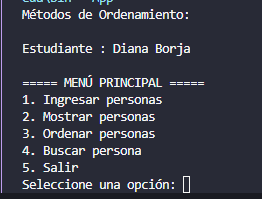
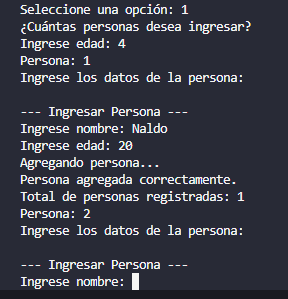
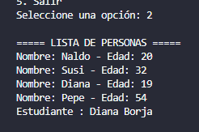
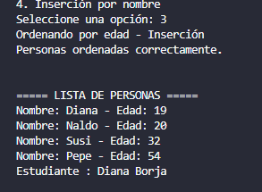
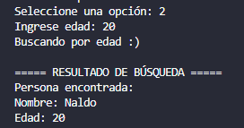
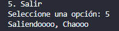

# ⚙️ Estructura de Datos

**Nombre**: Diana Borja

**Fecha**: 19/11/2025

**Correo**: dborjas2@est.ups.edu.ec

## Descripción
Este proyecto es una aplicación de consola desarrollada en Java, diseñada para gestionar un conjunto de objetos **Person** (Nombre y Edad). Su objetivo principal es demostrar la implementación de algoritmos clásicos de **Ordenamiento** y **Búsqueda**.

## Arquitectura y Organización

El sistema sigue un patrón de diseño **Modelo-Vista-Controlador (MVC)**, lo que permite una clara separación de responsabilidades:

1.  **Modelo (Person)**: Define los datos.
2.  **Vista (View)**: Maneja la interfaz de usuario (mostrar menús, solicitar entradas).
3.  **Controlador (Controller)**: Contiene la lógica central del negocio (cómo funciona el sistema).

---

## Funcionalidades del Menú

El programa principal permite al usuario realizar las siguientes operaciones sobre la lista de personas:

* **1. Ingresar Personas**: Permite registrar nuevos objetos **Person** en el sistema.
* **2. Mostrar Personas**: Visualiza la lista actual de todas las personas registradas.
* **3. Ordenar Personas**: Accede al submenú para seleccionar y aplicar diferentes métodos de ordenamiento.
* **4. Buscar Persona**: Accede al submenú para buscar un registro específico, aplicando validaciones previas.
* **5. Salir**: Finaliza la ejecución del programa.

---

## Conceptos de Algoritmos Implementados

El núcleo del proyecto reside en la implementación de diferentes estrategias para manipular el arreglo de personas.

### A. Métodos de Ordenamiento

Se implementaron varios algoritmos para organizar el arreglo, permitiendo ordenar tanto por **Nombre** como por **Edad**:

* **Ordenamiento por Intercambio (Burbuja)**: Un método simple que compara elementos adyacentes y los intercambia si no están en orden.
* **Ordenamiento por Selección**: Identifica repetidamente el elemento extremo (mayor o menor) y lo mueve a la posición correcta.
* **Ordenamiento por Inserción**: Construye el arreglo ordenado elemento por elemento, tomando los elementos de entrada y colocándolos en la posición adecuada en la sublista ya ordenada.

### B. Métodos de Búsqueda

Se implementó la **Búsqueda Binaria**, que es el método de búsqueda más eficiente para conjuntos de datos ordenados. 

## Capturas de la Ejecución 
## 1. **Visualización del Menú Principal**

## 2. **Ingreso de personas**

## 3. **Listado de personas**

## 4. **Ordenamiento de Personas**

## 5. **Buscar Personas**

## 6. **Salir del Sistema**

